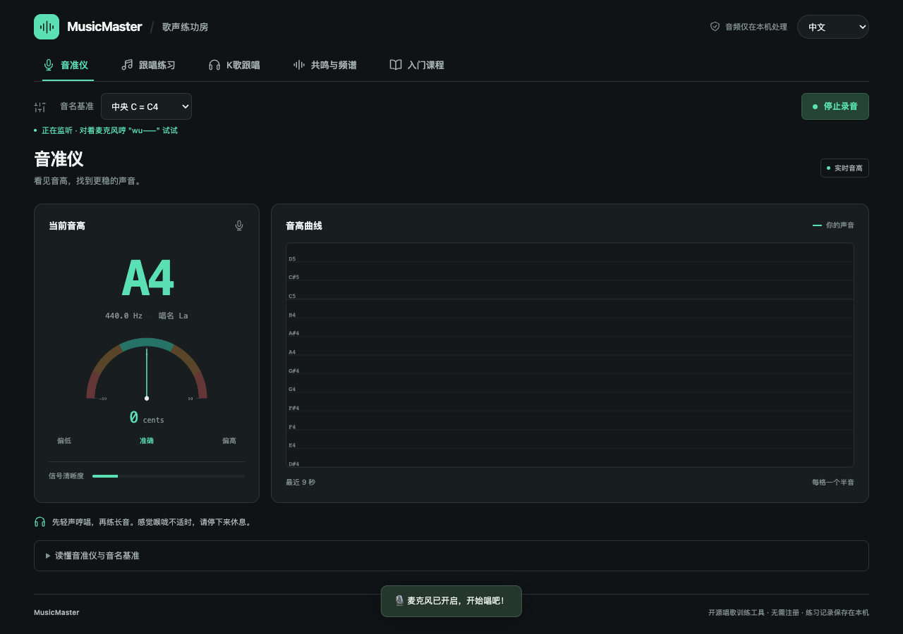
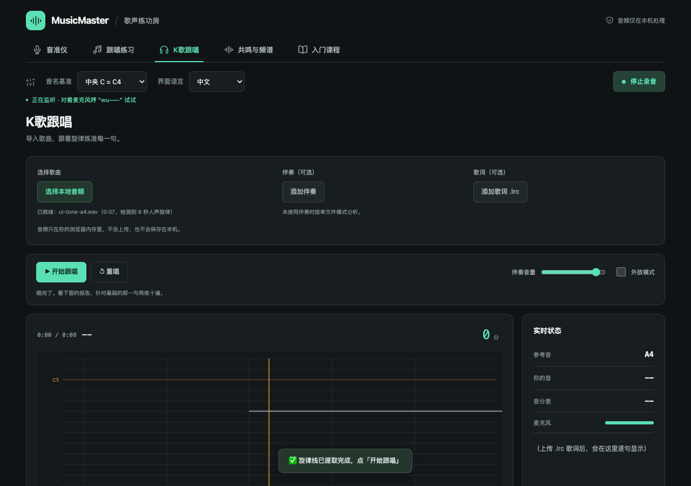
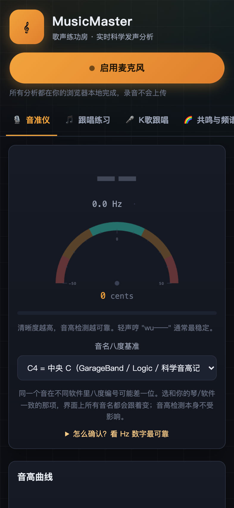
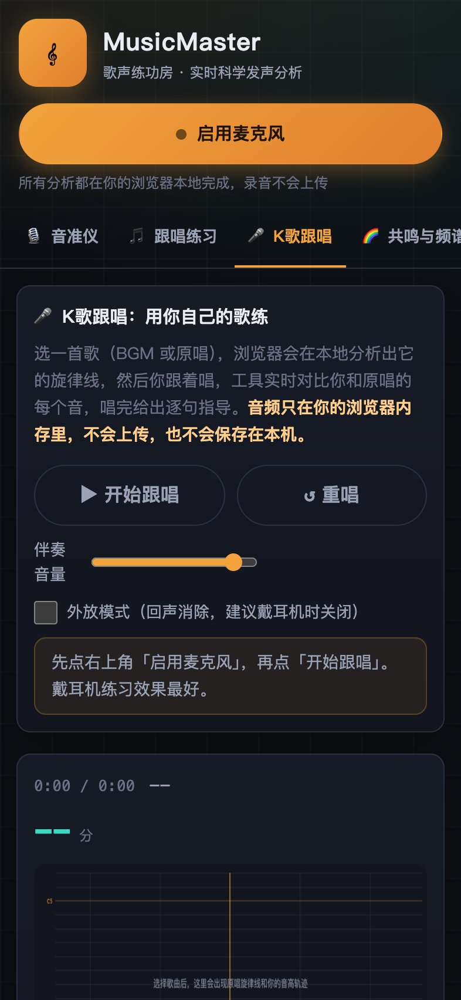
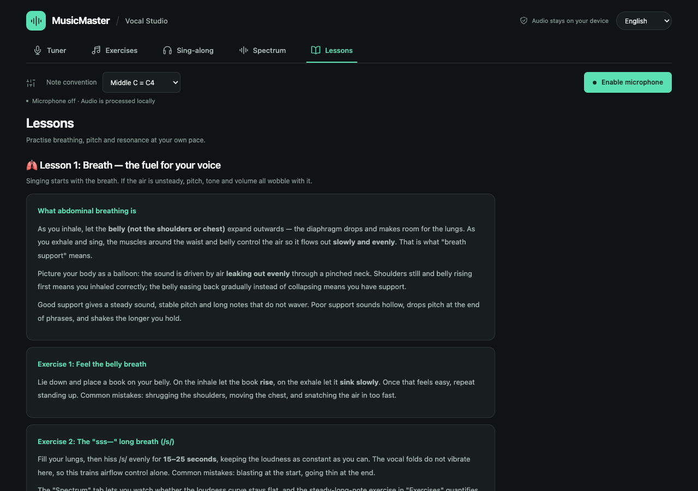
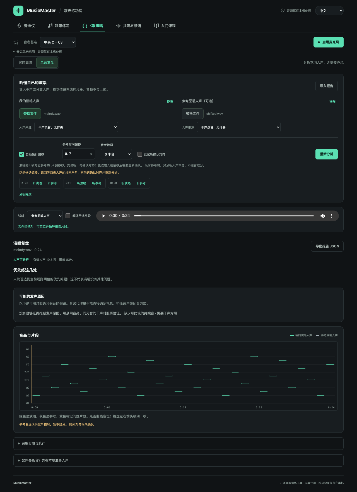

# MusicMaster · 歌声练功房

唱歌基本功训练与录音复盘工具：允许麦克风可实时练习；导入本地人声或离线报告可复盘已有演唱。**无需注册、无服务器，网页音频只在浏览器内存里处理。混音分离使用可选的本地工具，私人产物保存在已忽略的 `stems/`。**

[打开歌声练功房](https://mappedinfo.github.io/musicmaster/)

## 当前状态与接续

继续开发前，先阅读本节及下方的运行、测试和部署说明。本节是项目当前状态入口。

- 当前界面采用 React + Vite，按工作台、共享控件和功能面板拆分组件；音频分析内核保留在 `js/`。
- 语言切换固定在页头右上角，是全局控件，不随子页面重复出现；音名基准与麦克风在其下方的设置条里。K歌上传歌曲、伴奏、歌词与播放设置位于曲线前。长说明可展开阅读。
- 页面切换保留训练状态；停止录音释放声音采集，已导入歌曲留在当前页面内存中，重新启用麦克风后可继续练习。
- 成品可安装为本地应用（Chrome / Edge 应用窗口，iOS 添加到主屏幕），安装后断网也能打开。
- 发布流程先运行单元检查与构建，再把 `dist/` 部署到 GitHub Pages。本地音源分离工具、测试和音频素材不进入网站成品。
- K歌包含“实时跟唱｜录音复盘”。复盘顶部集中放置两份人声、报告导入、偏移与转调设置；结果依次展示可信度、最多三处优先观察、声乐假设、可定位曲线与完整统计。报告和音频可以分别导入，通过 SHA-256 核对回听文件。
- 录音复盘与本地命令共用 `js/recording-analysis.js`，报告格式为 `schemaVersion: 1`；无可靠参考或未确认对齐时不提供音准分。自动声乐假设附替代解释与验证练习，可信度尚未经校准。
- 验证更新于 2026-10-10：录音内核 23 组、K歌 80 项、DSP 19 项、固定偏移与双语键检查通过；本地工具 5 组与分离包装 43 项通过。构建版已有界面 286 项、录音复盘 31 项通过，包含自动偏移、成对回听、导入恢复、取消替换、手机布局与 PWA 离线分析；实际录音也验证了本地报告、两份人声身份与对齐回听。

## 功能

- **音准仪**：YIN 基频检测（±1 音分精度），音分表盘（±10 优 / ±25 合格 / ±50 唱错音）、实时音高曲线、唱名（do re mi…）提示。
- **跟唱练习**：5 种练习（单音模唱、音阶上/下行、长音稳定、五度跳进）× 7 个调，自动播示范音 → 你唱 → 逐音打分（60% 音准 + 40% 稳定），历史记录存 localStorage。
- **共鸣与频谱**：实时频谱、频谱质心、H1−H2（胸声/头声倾向启发式）、谐波占比、歌手共振峰（2.5–3.5 kHz）能量占比。
- **K歌跟唱**：上传本地音频（BGM 或原唱），浏览器在 Web Worker 里离线提取参考旋律线，跟着唱时实时对比每个音，唱完给逐句得分和针对性指导；支持 .lrc 歌词逐句评分、片段跳转重唱。**音频只在内存里，不上传、不落盘。**
- **录音复盘**：导入已分离或无伴奏的人声，无需麦克风；分析持续音漂移、波动、尾音强度与重复声乐现象，自动提出气息支撑、偏紧发声和漏气倾向等待验证假设。有独立参考且对齐可信时增加音高命中率、偏高/偏低、八度差与局部起音比较。支持 JSON 导入/主动导出、曲线跳转和片段循环试听。
- **音名八度基准**：可切换 C4=中央C（GarageBand / Logic / 科学音高记号）或 C3=中央C（Cubase / MuseScore / 部分硬件）。内部一律用 MIDI 编号计算，切换只影响显示。
- **音域测试**：滑音探测最低/最高音（2%/98% 分位抗噪）。
- **入门课程**：腹式呼吸、音准与音分、胸声/头声/混声（M1/M2/换声点）、共鸣科学、量化指标速查 + 四周入门计划。
- **中英双语**：界面、练习、K歌报告与课程正文全部支持中文 / English，在页头右上角切换并记忆选择；默认跟随浏览器语言。
- **可安装为本地应用**：带 Web App Manifest 与 Service Worker，Chrome / Edge 可"安装到本机"（独立窗口打开，断网可用），iOS Safari 可"添加到主屏幕"；浏览器允许安装时，页头会给出安装入口。
- **移动端适配**：手机 / iPad / 横屏布局、触摸目标 ≥32px、画布自适应、刘海屏安全区；手机默认开启 K歌外放回声消除。

## 界面

| 音准仪（音名八度可校准） | K歌跟唱 |
| --- | --- |
|  |  |

| 手机（音准仪） | 手机（K歌跟唱） |
| --- | --- |
|  |  |

英文界面（入口课程）：



录音复盘（合成音频演示，未使用私人录音）：



## 技术要点

- React 组件负责界面与导航，Canvas 和独立音频模块负责实时显示、训练与分析。Vite 构建生成静态成品，依赖版本锁定在 `package-lock.json`。
- 音频管线：getUserMedia → AudioWorklet 采集 → 主线程 YIN 音高检测（CMNDF + 抛物线插值，帧 2048 / 跳跃 512）+ AnalyserNode 频谱特征。外放模式控制回声消除与降噪，自动增益关闭。
- K歌离线旋律提取：decodeAudioData → OfflineAudioContext 重采样到 16kHz 单声道 → Web Worker 逐帧 YIN（帧 2048 / 跳跃 480，60–1100 Hz）→ 中值滤波去八度毛刺。
- K歌实时打分：只在参考线有音高的帧上比，±0.35s 窗口内取最近参考音，±50 音分算唱准；覆盖率、平均偏差、整体倾向、波动四项统计 + 4 秒分段，据此生成"偏低/偏高/波动/音域不合"等针对性建议。
- 录音复盘：16kHz 单声道、2048 采样窗与 20ms 步长，时间戳统一取窗中心。句段按静音分开，稳定平台与整句旋律分开统计；滑音、旋律换音和周期性颤音不按持续音不稳计。参考覆盖、演唱检出与有效比较比例分别统计，音高命中率只衡量有效配对帧。方法、自动推断与限制见 [录音分析说明](docs/recording-analysis.md)。
- 安装为本地应用：`public/manifest.webmanifest` 声明独立窗口与 192/512/maskable 图标；构建插件把 `tools/pwa/sw.template.js` 生成为 `dist/sw.js`，注入内容哈希版本和预缓存清单（导航请求网络优先、其余同源请求缓存优先），版本变化即整体失效旧缓存。图标由 `node tools/pwa/generate-icons.mjs` 生成，不引入图形依赖。开发模式不注册 Service Worker，避免缓存干扰热更新。
- 部署：GitHub Actions 静态 Pages 工作流（见 .github/workflows/pages.yml）。

## 本地运行

需要 Node.js 22.12+（推荐 24）。

```bash
npm ci
npm run dev
# 打开 http://localhost:8901
```

检查发布成品：

```bash
npm run build
npm run preview
```

麦克风权限要求 HTTPS 或 localhost。安装为本地应用与离线启动只在 `npm run build` 的产物里生效（`dist/sw.js` 由构建生成），验证安装和离线行为请用 `npm run preview`，不要用开发服务器。

## 部署到 GitHub Pages

仓库 Settings → Pages → Source 选择 **GitHub Actions**。推送 `main` 后，工作流执行 `npm ci`、`npm test` 和 `npm run build`，仅上传 `dist/`。构建资源使用相对地址，支持 `/musicmaster/` 项目子路径；Worker 和 AudioWorklet 也由构建管理。

## 测试

```bash
npm test                      # DSP、K歌、录音内核、固定偏移与双语键检查
node --test tools/vocal-analysis/test_analyze.mjs
uv run python tools/stem-separation/test_separate.py
uv run --with playwright playwright install chromium
npm run build && npm run preview
npm run test:ui                # 对 preview 运行可一并验证安装与离线启动，并更新截图
RUN_OFFLINE=1 npm run test:recording-ui  # 对构建预览运行，使用临时合成音频
uv run --with playwright python test/smoke.py
uv run --with playwright python test/karaoke_smoke.py
```

`test/ui_smoke.py` 支持 `BASE_URL` 指向部署站点或带子路径的成品；`SCREENSHOT_DIR` 可指定截图输出位置，`PLAYWRIGHT_CHROMIUM_EXECUTABLE` 可指定浏览器。对开发服务器运行时，需要 Service Worker 的离线用例会自动跳过并给出提示。旧的专项回归脚本仍保留在 `test/`。

`test/recording_ui_smoke.py` 使用相同的地址与浏览器选项；只有明确设置 `RUN_OFFLINE=1` 才运行离线要求。没有设置 `SCREENSHOT_DIR` 时不写截图。所有声音与报告均在临时目录生成。

K歌端到端测试会生成一个 A4 正弦 WAV，验证提取出的参考音高落在 MIDI 69 附近，并检查唱准时的评分与报告渲染。

冒烟测试用 `?testtone=220` 参数让页面以振荡器代替麦克风，可在无麦克风环境（CI/headless）验证完整分析管线。

## 本地工具

录音有伴奏时，先用完整离线流程分离人声并生成报告：

```bash
npm run analyze:recording -- /path/to/my-recording.m4a
# 首次准备依赖与模型；缓存准备好后可加 --offline
```

输出位于 `stems/private/<run-id>/`。双击其中的 `report.html` 可本地复盘；也可在网页导入 `analysis.json` 与对应的 `vocals.wav`。详见 [本地录音分析工具](tools/vocal-analysis/README.md)。请保持私人输出在 `stems/` 内。

`tools/stem-separation/` 提供独立 Demucs 包装，用于准备 K歌素材。网页不运行 Python；已有干声可直接使用网页分析。

用法见 [tools/stem-separation/README.md](tools/stem-separation/README.md)。

## 免责

所有指标是声学代理量，用于"自己和自己比较"的进步跟踪，不能替代声乐老师，也不构成嗓音医学诊断。
